<p align="center">
  
</p>

<p align="center">
  <a href="https://github.com/rmarnold/doomgen/actions/workflows/deploy.yml"></a>
  <br/>
  <a href="https://rmarnold.github.io/doomgen/"><strong>Live Demo</strong></a>
</p>

ASCII art generator with DOOM aesthetics. Transform text into stylized ASCII art with authentic DOOM color palettes and visual effects.

## Features

**Input**
- Real-time ASCII art generation using Figlet fonts
- Configurable character layout modes (Default, Full, Fitted)

**Style** (collapsible panel with sub-sections)
- *Palette* — Authentic DOOM color palettes (DOOM1, DOOM2, TNT, Plutonia) with background color picker and transparent mode
- *Gradient* — Direction modes (None, Horizontal, Vertical, Diagonal, Radial), brightness normalization, palette range sliders, zoom control
- *Effects* — Glow, Drip, Drop Shadow, Distress, Pixelation, Color Shift, Screen Shake
- *CRT Monitor* — Scanlines, phosphor vignette, curvature, flicker, power loss, screen blip

**Export** (categorized by format type)
- *Still* — PNG, WebP, Copy Image
- *Animated* — Animated WebP, SVG (CSS animations), HTML (JS animations)
- *Text* — Copy Text, ANSI, Shell Banner
- *Data* — JSON preset export/import

**Other**
- Mobile-responsive design with floating export bar
- GSAP-powered page entrance animations
- Accessibility: respects `prefers-reduced-motion`

## Development

Install dependencies:

```bash
npm install
```

Start development server:

```bash
npm run dev
```

## Building

Create production build:

```bash
npm run build
```

Preview production build:

```bash
npm run preview
```

## Testing

Run build tests:

```bash
bash UNITTEST/test-build.sh
```

Full test cycle:

```bash
bash TOOLS/full_test_cycle.sh
```

## Deployment

Deployed to GitHub Pages via GitHub Actions. Push to `main` branch triggers automatic deployment.

## Tech Stack

- SvelteKit 5 (Runes API)
- TypeScript
- Tailwind CSS v4
- Figlet.js
- GSAP
- html-to-image
- chroma-js

## License

MIT
